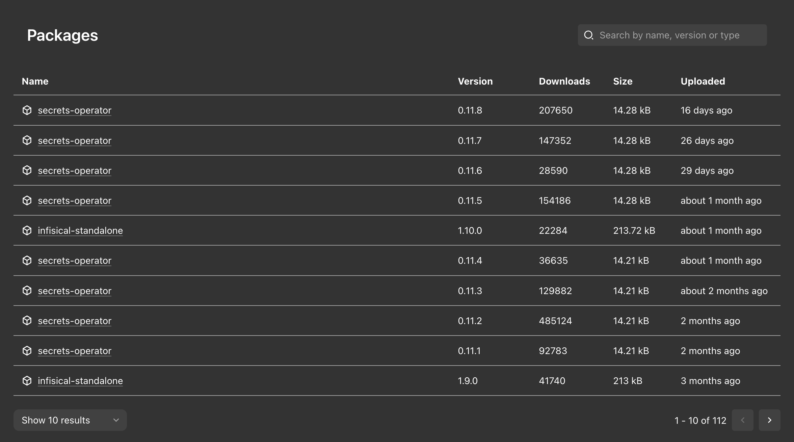

# Cloudsmith plugin for Backstage

The Cloudsmith plugin adds an entity tab listing the package versions an entity has published to [Cloudsmith](https://cloudsmith.com).



The tab appears on entities carrying the `cloudsmith.com/packages` annotation, and lists every version of the annotated packages, newest first, linking each one to its page in Cloudsmith.

> [!NOTE]
> These plugins are built for the [new frontend system](https://backstage.io/docs/frontend-system/) and [Backstage UI](https://backstage.io/docs/backstage-ui/overview). They do not ship a legacy frontend system export.

## Plugins

- [cloudsmith](./plugins/cloudsmith/README.md) - The frontend plugin providing the entity tab.
- [cloudsmith-backend](./plugins/cloudsmith-backend/README.md) - The backend plugin querying the Cloudsmith API.
- [cloudsmith-common](./plugins/cloudsmith-common/README.md) - Types and helpers shared between the two.

## Quick start

Both the frontend and the backend plugin are required. Detailed instructions are in each plugin's readme.

```sh
# From your Backstage root directory
yarn --cwd packages/app add @backstage-community/plugin-cloudsmith
yarn --cwd packages/backend add @backstage-community/plugin-cloudsmith-backend
```

## Limitations

The backend reads a single Cloudsmith organization and a single API key from `app-config.yaml`, so every annotated package is resolved against that one organization. Entities spread across multiple Cloudsmith organizations are not supported.
